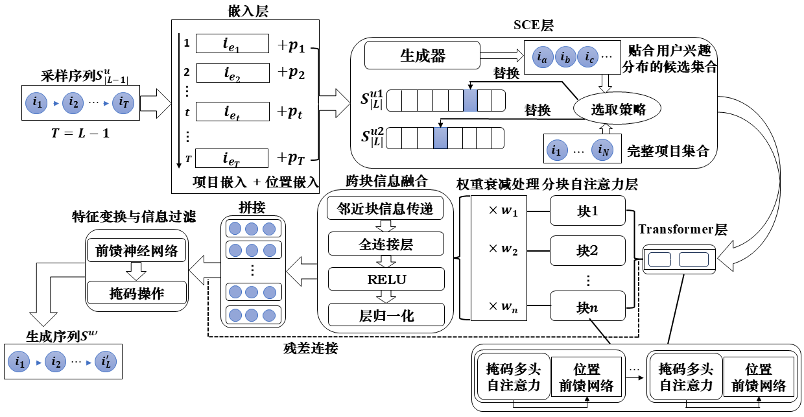

# SCEGAN: 基于数据增强和融合自注意力的序列推荐算法

## 问题陈述

1. **如何充分捕捉并利用时序信息，以更准确地描述用户兴趣的动态变化？**
2. **如何有效利用数据增强技术来减少网络模型参数量并降低随机性带来的噪声干扰？**

## 贡献

本项目提出了一种结合分块自注意力机制、权重衰减策略与扩展SSE方法的混合模型。通过这些创新，我们有效地平衡了推荐多样性与用户行为模式的稳定性。在多个数据集上进行了系列实验，特别关注长序列和短序列推荐任务的表现。实验结果表明，所提出的方法能够显著提升推荐系统的性能。

## 模型架构



### 环境要求

- **Python**: 3.6
- **TensorFlow**: 1.13.1

### 依赖库
- **numpy** ==1.19.2
- **torch** ==1.13.1
- **pandas** ==1.1.5
- **scikit-learn** ==0.24.2
- **matplotlib** ==2.2.5

## 项目结构
- `README.md`：项目介绍
- `main.py`：主程序文件
- `data/`：数据集文件夹
  - `data.txt`：数据文件
- `dis_model.py`：鉴别器模型
- `dis_modules.py`：鉴别器模块
- `dis_sampler.py`：鉴别器采样
- `gen_model.py`：生成器模型
- `gen_modules.py`：生成器模块
- `gen_augmentation_sampler.py`：生成器增强采样器
- `gen_sampler.py`：生成器采样器
- `util.py`：辅助工具文件（数据处理等）

### 运行代码
```bash
python main.py --dataset=data/XXX --train_dir=default
